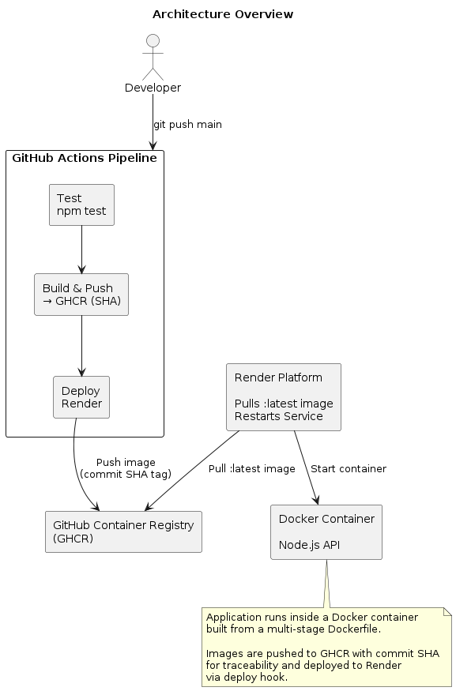

# Kora Analytics — DeployReady

A containerised, continuously deployed Node.js API for Kora Analytics — a SaaS platform serving data dashboards to logistics companies.

This repository demonstrates a production-oriented DevOps setup built from scratch: containerisation, an automated CI/CD pipeline, and cloud deployment on Render.

**Live URL:** https://deployready-assignment-latest.onrender.com

---

## Architecture Overview



The application runs inside a Docker container built from a multi-stage `Dockerfile`. Images are pushed to GitHub Container Registry (GHCR) tagged with the commit SHA for traceability, and deployed to Render via a deploy hook.

---

## The Application

A simple Node.js/Express API with three endpoints:

| Method | Route | Description |
|---|---|---|
| GET | `/health` | Returns `{"status":"ok"}` |
| GET | `/metrics` | Returns uptime, memory usage, and Node version |
| POST | `/data` | Accepts a JSON body and echoes it back |

---

## Project Structure

```
.
├── .github/
│   └── workflows/
│       └── deploy.yml        # CI/CD pipeline (test → build → push → deploy)
├── app/
│   ├── index.js              # Express application
│   ├── index.test.js         # Jest + Supertest test suite
│   ├── package.json
│   └── package-lock.json
├── .dockerignore             # Excludes .env, node_modules, test files
├── .env.example              # Placeholder env vars — copy to .env to run locally
├── .gitattributes            # Enforces LF line endings across all platforms
├── Dockerfile                # Multi-stage production image
├── docker-compose.yml        # Local development stack
└── DEPLOYMENT.md             # Full cloud deployment documentation
```

---

## Running Locally

**Prerequisites:** Docker and Docker Compose installed.

```bash
# 1. Clone the repository
git clone https://github.com/Gery44/DeployReady_Assignment.git
cd DeployReady_Assignment

# 2. Create your local env file
cp .env.example .env

# 3. Build and start the container
docker compose up --build
```

The API will be available at `http://localhost:3000`.

**Verify it's working:**
```bash
curl http://localhost:3000/health
# {"status":"ok"}

curl http://localhost:3000/metrics
# {"uptime_seconds":12,"memory_mb":54,"node_version":"v20.14.0"}

curl -X POST http://localhost:3000/data \
  -H "Content-Type: application/json" \
  -d '{"shipment_id":"KOR-001","status":"in_transit"}'
# {"received":{"shipment_id":"KOR-001","status":"in_transit"}}
```

---

## CI/CD Pipeline

Defined in `.github/workflows/deploy.yml`. Triggers on every push to `main`.

### Job 1 — Test
- Sets up Node 20 with a cached `npm ci` install
- Runs `jest --forceExit`
- Pipeline stops immediately if any test fails — nothing gets built or deployed

### Job 2 — Build & Push
- Builds the Docker image using the multi-stage `Dockerfile`
- Tags the image with the full commit SHA (immutable) and `latest`
- Pushes both tags to GitHub Container Registry (GHCR)
- Uses registry-based layer caching to speed up subsequent builds

### Job 3 — Deploy
- Calls the `RENDER_DEPLOY_HOOK` GitHub secret via `curl`
- Render pulls the `:latest` image from GHCR and restarts the service

### Secrets

All secrets are stored in GitHub repository settings — never in code.

| Secret | Purpose |
|---|---|
| `RENDER_DEPLOY_HOOK` | Authenticated Render deploy hook URL |
| `GITHUB_TOKEN` | Auto-generated by Actions — used to push to GHCR |

---

## Docker Setup

### Dockerfile highlights

- **Multi-stage build** — `deps` stage installs production dependencies only (`npm ci --omit=dev`), keeping jest and supertest out of the final image
- **Pinned base image** — `node:20.14.0-alpine3.20` for reproducible builds
- **Non-root user** — runs as `appuser:appgroup`, not root
- **Signal-safe CMD** — `CMD ["node", "index.js"]` as a JSON array so SIGTERM reaches the Node process directly for graceful shutdown

### docker-compose.yml highlights

- Reads environment variables from `.env` via `env_file`
- Port mapping uses `${PORT:-3000}` to stay in sync with the env file
- Built-in `healthcheck` polling `GET /health` every 30 seconds
- `restart: unless-stopped` for automatic recovery after host reboots

---

## Deployment

Full deployment documentation is in [`DEPLOYMENT.md`](./DEPLOYMENT.md), covering:

- Why Render was chosen and the trade-offs vs a raw VM
- How the Render Web Service was configured to pull from GHCR
- How to check if the service is running
- How to view application logs

---

## Decisions Made

**Multi-stage Dockerfile** — separating the dependency install stage from the production stage means devDependencies never make it into the final image. Smaller image, smaller attack surface.

**GHCR over Docker Hub** — GHCR is scoped to the repository and uses the auto-generated `GITHUB_TOKEN`. No external account, no rotating credentials, no extra secrets to manage.

**Commit SHA tagging** — every image pushed to GHCR is tagged with the exact commit SHA. You always know precisely which version of the code is running in production.

**Render over a raw VM** — for the scope of this challenge, Render eliminates VM provisioning, OS patching, and SSH key management while still running the exact Docker image built and tested in CI. The trade-offs (no direct OS access, less control over networking) are acceptable here and documented in `DEPLOYMENT.md`.

**`.gitattributes`** — enforces LF line endings across all contributors and CI runners, preventing shell scripts and YAML files from breaking on Linux runners when developed on Windows.
